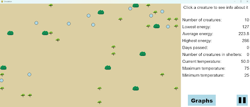
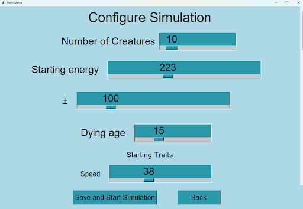
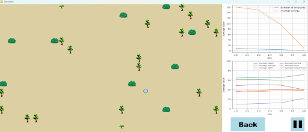

# Evolution Simulator

This is an interactive Python simulation exploring how different creature traits influence behaviour, resource management, survival and reproduction over time as they evolve.

The simulation models autonomous creatures living in a changing environment. Each creature has individual traits that affect how it behaves and survives, while reproduction allows traits to be inherited by future generations.

## Features

- Autonomous creatures with individual traits including:
  - Speed
  - Strength
  - Sight
  - Farming ability
  - Social behaviour
  - Temperature preference
- Resource gathering including food and wood
- Energy management and age-based mortality
- Reproduction and inheritance, with offspring traits decided from their parents' traits
- Social groups allowing creatures to cooperate and transfer energy
- Predation, where creatures can pursue and consume other creatures
- Environmental temperature and seasonal changes
- Shelters that provide protection from environmental temperatures
- A* pathfinding for creature navigation
- Configurable simulations with adjustable population, traits, resources and environmental settings
- Save/load functionality using JSON
- Interactive creature inspection and modification
- Simulation statistics and visualisations for population, energy and trait changes over time

## How It Works

Each creature has a collection of traits and internal states that influence its decisions.

During the simulation, creatures:

1. Search their surroundings for resources and other creatures.
2. Decide which action to take based on their needs and traits.
3. Navigate through the environment using pathfinding.
4. Consume food and wood to obtain resources.
5. Form social groups and cooperate with other creatures.
6. Seek shelter when environmental conditions require it.
7. Reproduce when sufficient energy is available.
8. Pass traits to their offspring.

As the simulation progresses, changes in the population and the distribution of traits can be observed through the simulation and its generated statistics.

## Pathfinding

Creature movement uses an implementation of the A* pathfinding algorithm.

The environment is represented as a grid of tiles. Movement costs are influenced by the surrounding environment and, where relevant, the characteristics of creatures in nearby tiles.

A heuristic based on octile distance is used to estimate the remaining distance to the destination.

This allows creatures to navigate around obstacles and dynamically respond to other creatures and their surroundings.

## Configuration

Before starting a simulation, the main menu allows the user to configure parameters including:

- Number of creatures
- Starting energy
- Initial trait values and variation
- Number of bushes and trees
- Resource growth rates
- Energy gained from food
- Wood yield from trees
- Maximum age
- Minimum and maximum temperature
- Season length

This allows different environments and starting populations to be tested.

## Data and Visualisation

The simulation records statistics as it runs, including:

- Population size
- Average energy
- Average speed
- Average strength
- Average sight
- Average farming ability
- Average social behaviour
- Average temperature preference

These statistics can be visualised during runtime to observe how the population changes over time.

## Saving and Loading

Simulation states can be saved as JSON files and loaded again later.

Saved simulations preserve the state of the creatures, resources, shelters and simulation settings, allowing an experiment to be paused and continued later.

## Installation

Clone the repository and navigate into the project directory.

Install the required python packages using:

```bash
pip install -r requirements.txt
```

The simulation can then be run by using:

```bash
python main_menu.py
```

The main menu provides options to:

- Start a new simulation
- Load an existing simulation
- View information about the simulation
- Exit the application

## Libraries

- Python
- Pygame - simulation rendering and interaction
- Tkinter - configuration interface
- Matplotlib - simulation statistics and visualisation
- JSON - simulation state persistence

## Background

This project was developed as an A-level Computer Science project and became a simulation involving autonomous agents, resource management, pathfinding, social behaviour and reproduction.

The project provided experience with object-oriented programming, algorithm design, state management, graphical interfaces, data visualisation and developing a larger multi-file Python application.

## Screenshots

### Simulation



### Configuration



### Statistics



## Credits and Licences

Some graphical assets used in this project are licensed under
[CC BY-ND 4.0](https://creativecommons.org/licenses/by-nd/4.0/).

The relevant assets are used in accordance with their licence terms and
the original creator is credited here:

- "Pixel Art Bush" by ManicPixelDreamGirl — https://manicpixeldreamgirl.itch.io/pixelartbush